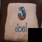
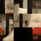
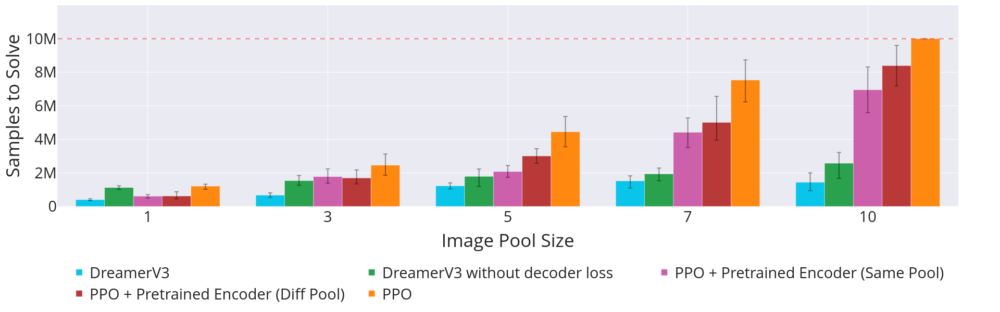
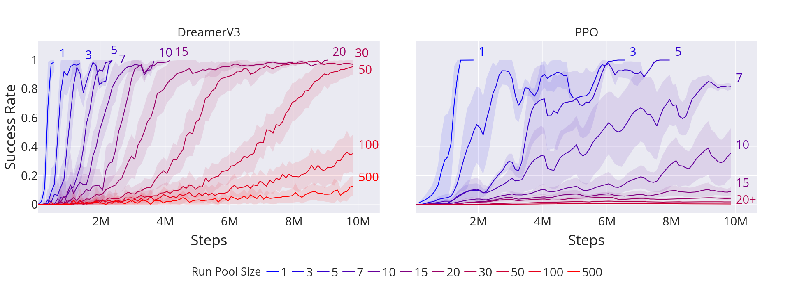

# Sliding Puzzles Gym: A Scalable Benchmark for State Representation in Visual Reinforcement Learning

<p align="center">
  
  
  
</p>

> A PPO agent solving the environment.

This repository contains the official implementation of experiments for the paper [Sliding Puzzles Gym: A Scalable Benchmark for State Representation in Visual Reinforcement Learning](). This includes PPO and DreamerV3 implementations along with scripts to reproduce all results.

The code for PPO was adapted from the [CleanRL implementation](https://github.com/vwxyzjn/cleanrl/blob/master/cleanrl/ppo_atari.py), and the code for DreamerV3 was adapted from the [official implementation](https://github.com/danijar/dreamerv3).
The benchmark environment itself can be found at https://github.com/bryanoliveira/sliding-puzzles-gym.

## Requirements

1. Setup the benchmark

To install the Sliding Puzzles Gym (SPGym), run the following command:

```bash
pip install sliding-puzzles
```

You can alternatively clone the repository and install it as an editable package:

```bash
git clone https://github.com/bryanoliveira/sliding-puzzles-gym
cd sliding-puzzles-gym
pip install -e .
```

To use the `imagenet-1k` dataset you will also need to download the dataset from https://huggingface.co/datasets/ILSVRC/imagenet-1k/blob/main/data/val_images.tar.gz and extract it to `<package install location>/imgs/imagenet-1k`. You can do this automatically by running the following command:

```bash
sliding-puzzles setup imagenet
```

2. Prepare Python environments

Create separate Python environments for Dreamer and PPO. `requirements.txt` can be found inside each correspondent folder, and Dockerfiles are also available. See `dreamer/README.md` and `ppo/README.md` for more details.

## Training

Scripts for reproducing the paper results can be found in `dreamer/scripts` and `ppo/scripts`. Seeds are generated automatically by the algorithms if not specified. For example, inside `dreamer` or `ppo` folders, run:

```train
bash scripts/scale.sh
```

## Results

These are the expected results:



> <b>Average number of steps to solve the puzzle as a function of the pool size.</b> We consider the puzzle solved when the agents reach $80\%$ success rate and limit the maximum number of environment steps per run to 10 million. Error bars represent the $95\%$ confidence interval of a bootstrap with 1,000 resamples from 5 independent seeds.



> <b>Success rate as a function of environment steps.</b> Gradual increase in representation complexity impacts sample efficiency for PPO and DreamerV3 agents. Error bands represent the $95\%$ confidence interval of a bootstrap with 1,000 resamples from 5 independent seeds and a rolling window of 10,000 environment steps.